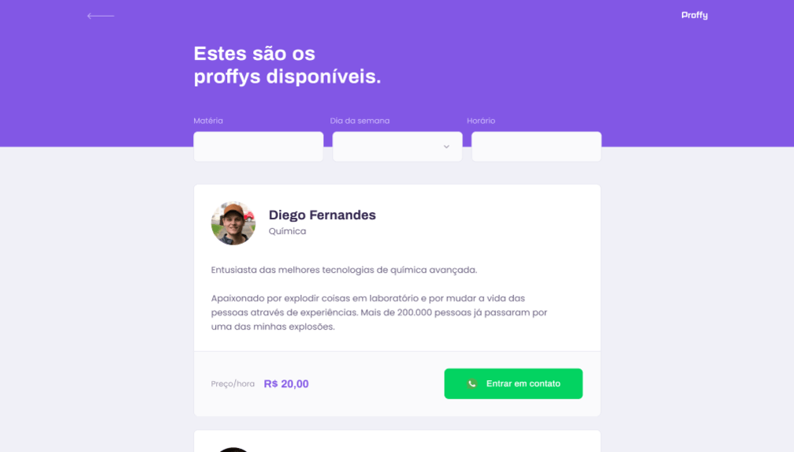

<p align="center">
   
</p>


> :rocket: Projeto desenvolvido para conectar professores e estudantes, feito durante a na Next Level Week #2 @Rocketseat


<div align="center">
  <sub>The NLW #2 project. Built with ❤︎ by
    <a href="https://github.com/clebsonsantos">Clebson Santos</a> 
  </sub>
</div>

# :pushpin: Tabela de Conteúdo


* [Tecnologias](#computer-tecnologias)
* [Funcionalidades](#rocket-funcionalidades)
* [Como rodar](#construction_worker-como-rodar)
* [Licencia](#closed_book-licencia)


### Web Screenshot
<div style="display: flex; flex-direction: 'row'; align-items: 'center';">
   
   
</div>

### Mobile Screenshot
<div style="display: flex; flex-direction: 'row';">
   
   
   
   
</div>


# :computer: Tecnologias
Esse projeto foi feito utilizando as seguintes tecnologias:

* [Typescript](https://www.typescriptlang.org/)      
* [React](https://reactjs.org/)      
* [Expo](https://expo.io/)       
* [Express](https://expressjs.com/) 
* [NodeJS](https://nodejs.org/) 

# :rocket: Funcionalidades

* Site para cadastro de estudante e professores.
* App para conectar estudantes e professores.

# :construction_worker: Como rodar
```bash
# Clone o Repositoria
$ git clone https://github.com/clebsonsantos/proffy-omnistack.git
```
### 📦 Rode a API

```bash
# Vá para a pasta do servidor
$ cd proffy-omnistack/server

# Instale as depedencias
$ npm install

# Rode a aplicação
$ npm start
```
Acesse a API: http://localhost:3333/

### 💻 Rode o Project Web

```bash
# Vá para a pasta web
$ cd proffy-omnistack/web

# Instale as depedencias
$ npm install

# Rode a aplicação
$ npm start
```
Acesse: http://localhost:3000/ para ver o resultado.

### 📱 Rode o projeto Mobile
Para rodar o projeto mobile você precisa de um celular com o [expo](https://play.google.com/store/apps/details?id=host.exp.exponent) instalado ou um emulador android/ios.

```bash
# Vá para a pasta mobile
$ cd proffy-omnistack/mobile

# Instale as depedencias
$ npm install

# Rode a aplicação
$ npm start
```
Depois leia o QRCode com o app do [expo](https://play.google.com/store/apps/details?id=host.exp.exponent) ou rode em um emulador.


# :closed_book: Licencia


Feito com 💙 por  [Clebson Santos](https://github.com/clebsonsantos) 🚀.
Esse projeto esta sobre [MIT license](./LICENSE).


Dê uma ⭐️ se esse projeto te ajudou!
